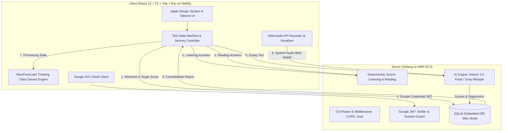
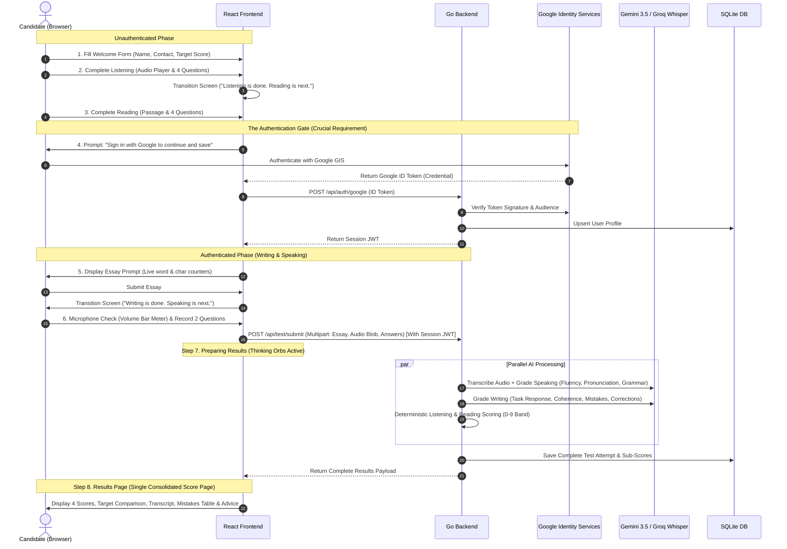

# Matalabs — 4-Skill English Proficiency Assessment

A modern, full-stack web application designed for a 4-skill English proficiency diagnostic (Listening, Reading, Writing, Speaking). Engineered with an Apple-tier design language, custom animated Thinking Orbs, Go backend with embedded SQLite persistence, and a React + TypeScript + Tailwind CSS v4 frontend.

---

## 1. System Architecture



---

## 2. End-to-End User Journey



---

## 3. Technology Stack

| Layer | Technologies | Rationale |
| :--- | :--- | :--- |
| **Frontend** | React 19, TypeScript, Vite, Bun, Tailwind CSS v4, Framer Motion, Lucide Icons | Sub-second cold starts, Apple-inspired physics & micro-interactions, responsive dark/light modes. |
| **Animation** | RareFormLabs Thinking Orbs (HTML5 2D Canvas) | High-performance particle orbit loading indicator for AI states (`listening`, `solving`, `shaping`). |
| **Backend** | Golang (Go 1.27+), Chi Router, Gzip, CORS | Lightweight memory footprint (< 15MB RAM), sub-millisecond route handling, native goroutines for parallel AI scoring. |
| **Database** | Embedded SQLite (`modernc.org/sqlite` pure Go) with WAL Mode | Zero external cloud DB latency, single-node transactional durability, zero configuration. |
| **AI Engine** | Google Gemini 3.5 Flash & Groq (`whisper-large-v3-turbo` + `openai/gpt-oss-120b`) | 100% free multimodal evaluation, real acoustic speech-to-text transcription, diagnostic grammar feedback. |
| **Authentication**| Google Identity Services (GIS) + HMAC-SHA256 Session JWTs | Secure 1-click authentication, protects Writing/Speaking endpoints against unauthenticated access. |

---

## 4. Local Development Setup

### Prerequisites
- [Bun](https://bun.sh/) (v1.2+) installed
- [Go](https://go.dev/) (v1.22+) installed

### Single-Command Start (Root Dev Orchestration)
From the repository root, install dependencies and launch both servers simultaneously:

```bash
# 1. Install root orchestration packages
bun install

# 2. Run both Backend (:8080) and Frontend (:5173) concurrently
bun run dev
```

### Running Components Independently
```bash
# Frontend only
bun run dev:frontend

# Backend only
bun run dev:backend

# Build frontend production bundle
bun run build:frontend
```

---

## 5. Environment Variables Configuration

Create `.env` in `frontend/` and `backend/` using the provided `.env.example` templates:

### `frontend/.env`
```env
VITE_API_URL=http://localhost:8080
VITE_GOOGLE_CLIENT_ID=your_google_client_id.apps.googleusercontent.com
```

### `backend/.env`
```env
PORT=8080
ENV=development
GOOGLE_CLIENT_ID=your_google_client_id.apps.googleusercontent.com
GEMINI_API_KEY=your_gemini_api_key_here
GROQ_API_KEY=your_groq_api_key_here
JWT_SECRET=your_random_secure_jwt_secret_string
DATABASE_PATH=./data/english_test.db
CORS_ORIGIN=http://localhost:5173
```

---

## 6. Google OAuth 2.0 Setup Guide for Reviewers

1. Open [Google Cloud Console](https://console.cloud.google.com/).
2. Navigate to **Google Auth Platform** (or **APIs & Services &rarr; Credentials**).
3. Under **OAuth consent screen**, select **External**, provide an app name (e.g. `English Test`), and save.
4. Under **Credentials**, click **Create Credentials &rarr; OAuth client ID**:
   - **Application type**: Web application
   - **Authorized JavaScript origins**:
     - `http://localhost:5173`
     - `https://your-site.netlify.app` (when deploying)
   - **Authorized redirect URIs**:
     - `http://localhost:5173`
5. Copy the generated **Client ID** into `frontend/.env` (`VITE_GOOGLE_CLIENT_ID`) and `backend/.env` (`GOOGLE_CLIENT_ID`).

---

## 7. Production Deployment Runbook

### A. Deploying Backend to AWS EC2 (Ubuntu)
The Go backend runs with minimal CPU/RAM overhead and does not require an external database daemon.

1. SSH into your EC2 instance and clone the repository:
   ```bash
   git clone <repo-url> matalabs
   cd matalabs/backend
   ```
2. Build the Linux binary:
   ```bash
   go build -o server .
   ```
3. Configure environment variables in `/home/ubuntu/matalabs/backend/.env`.
4. Install and enable the systemd service (pre-configured in `backend/matalabs-test.service`):
   ```bash
   sudo cp matalabs-test.service /etc/systemd/system/
   sudo systemctl daemon-reload
   sudo systemctl enable --now matalabs-test
   ```
5. Verify service health:
   ```bash
   curl http://localhost:8080/api/health
   # {"status":"healthy","time":"..."}
   ```

### B. Deploying Frontend to Netlify
1. Connect the GitHub repository to Netlify.
2. Configure build settings:
   - **Base directory**: `frontend`
   - **Build command**: `bun run build`
   - **Publish directory**: `dist`
3. In the Netlify dashboard under **Site configuration &rarr; Environment variables**, set:
   - `VITE_API_URL`: Your EC2 backend domain or API URL.
   - `VITE_GOOGLE_CLIENT_ID`: Your Google OAuth Client ID.
4. Client-side SPA routing rewrites are pre-configured in `frontend/netlify.toml` with **zero public IP exposure**.

---

## 8. Evaluation Logic & Resilience

1. **Objective Scoring (Listening & Reading)**:
   - Evaluated deterministically against answer keys.
   - Converted to the IELTS 0–9 half-band scale (2.5 to 8.5). Scores remain hidden until the final results screen.
2. **Subjective AI Scoring (Writing & Speaking)**:
   - **Writing**:
     - Words < 5: Score 0.0 (rule-based pre-check).
     - Words < 30: Score $\le$ 2.5 (short attempt penalty).
     - Full essay: AI evaluates Task Response, Coherence, Lexical Resource, and Grammar. Returns specific mistakes with original erroneous text, corrections, and actionable tips.
   - **Speaking**:
     - Browser records live microphone stream (WebM audio blob).
     - AI transcribes spoken audio verbatim and evaluates fluency, pronunciation clarity, and lexical variety.
     - If the candidate remains silent or audio is corrupt, returns an honest low score and clear diagnostic message rather than inventing a fake 6.5.
3. **Consolidated Results**:
   - Overall score is the arithmetic mean of the four assessed competencies, rounded to **one decimal place** (e.g. `6.5`, not `6.47`).
   - Diagnostic logic automatically highlights the lowest scoring competency under **"What to Practise First"** with specific next-step advice.
   - **Zero payment, zero paywalls, zero unlock buttons.**
